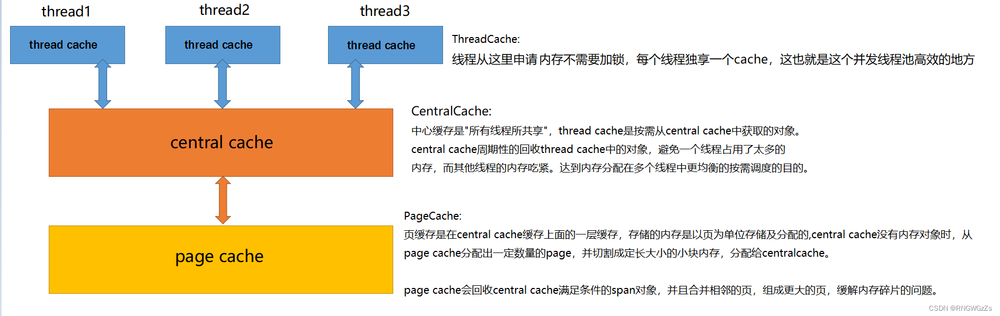
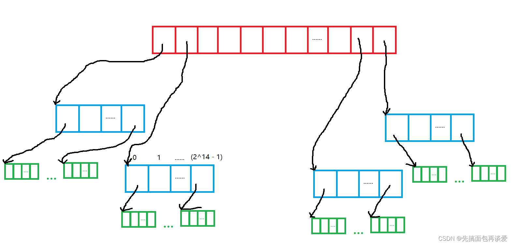
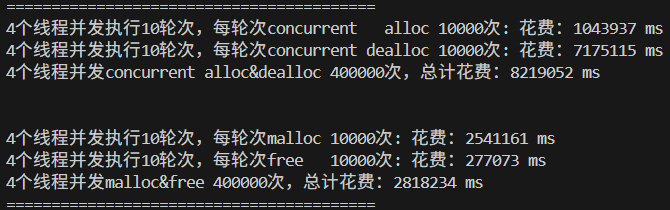
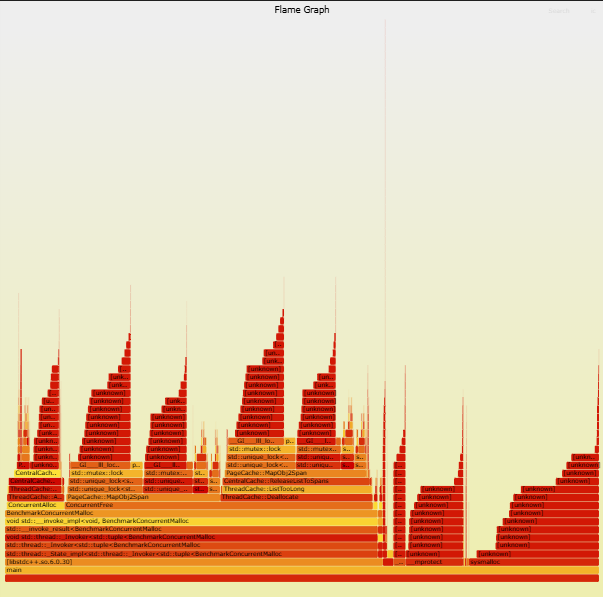
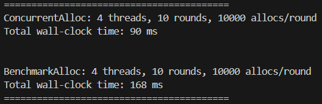
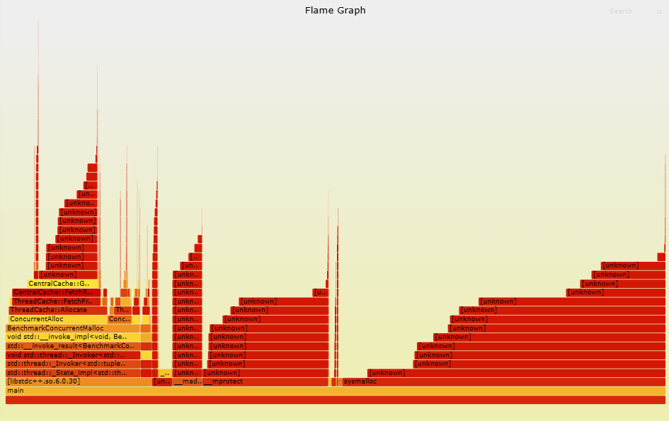

# ConcurrentMemoryPool
**本项目为一个C++实现高并发内存池（Linux版）**

在Terminal中输入：`g++ -g -o2 -I include/ src/* Benchmark.cpp -o main -pthread`，即可编译。

如果不需要调试信息，可以直接：`g++ -I include/ src/* Benchmark.cpp -o main -pthread`，生成可执行文件`main`后 `./main` 运行，看到测试结果。

### 内存池结构

包含三层缓存结构：

- ThreadCache
- CentralCache
- PageCache

### 优化

使用三层基数树优化锁相关的性能瓶颈

### 结果图

优化前：

优化后：

可以看到少了很多unique_lock的开销。

### Linux版本与Windows版本的区别
1. Linux申请和释放空间使用函数不同，参考include/Common.h
2. 本次开发使用的linux系统页面大小为4KB，不是8KB，因此static const size_t PAGE_SHIFT = 12，2<<12 = 4KB

3. Linux下地址空间为64位
4. Linux64为地址空间下，下基数树必须使用三层，参考include/PageMap.h

### 参考文献

- [【项目】九万字手把手教你写高并发内存池（化简版tcmalloc）_【项目】九万字手把手教你写高并发内存池(化简版tcmalloc)-csdn博客-CSDN博客](https://blog.csdn.net/m0_62782700/article/details/135443352)
- [内存管理优化：从定长内存池到TCMalloc实践-CSDN博客](https://blog.csdn.net/RNGWGzZs/article/details/128329729)
